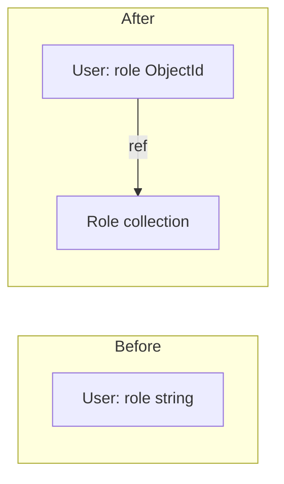

# Learning Guide 2: Roles, Migrations, Seeders, and Permissions

This guide walks through the changes made to add a **roles** collection, link it to users, migrate existing data, seed default data, and enforce permissions on routes. It assumes you have read [LEARN.md](LEARN.md) and understand NestJS basics (modules, controllers, services, guards, decorators).

---

## Table of Contents

1. [Overview: What Changed](#1-overview-what-changed)
2. [Adding a New Collection (Roles)](#2-adding-a-new-collection-roles)
3. [Linking Users to Roles](#3-linking-users-to-roles)
4. [Database Migrations](#4-database-migrations)
5. [Seeders with Dependencies](#5-seeders-with-dependencies)
6. [Permission Enforcement](#6-permission-enforcement)
7. [End-to-End Flow](#7-end-to-end-flow)

---

## 1. Overview: What Changed

Previously, users had a simple string field `role: 'admin' | 'user'`. The application now uses:

- A **roles** collection storing role names and per-module permissions
- Users reference roles via **ObjectId** instead of strings
- **Migrations** to convert existing string-based roles to ObjectId references
- **Seeders** that create default roles first, then users that reference them
- A **PermissionsGuard** that checks `permissions[module][action]` before allowing access



---

## 2. Adding a New Collection (Roles)

### Schema Design

The roles collection stores a name and a nested permissions object. Each module (e.g. `users`, `roles`) has four actions: `view`, `create`, `edit`, `delete`.

```typescript
export class ModulePermissions {
  view: boolean;
  create: boolean;
  edit: boolean;
  delete: boolean;
}

export class Permissions {
  users: ModulePermissions;
  roles: ModulePermissions;
}

@Schema({ timestamps: true })
export class Role {
  @Prop({ required: true, unique: true, trim: true, lowercase: true })
  name: string;

  @Prop({ type: Object, required: true })
  permissions: Permissions;
}
```

Using `@Prop({ type: Object })` tells Mongoose to store the nested object as-is. No sub-schema is needed for this use case.

### Full Module Structure

A new feature module follows the same pattern as Users: schema, DTOs, service, controller, module. The module exports `RolesService` so other modules (Users, Auth, Seeders) can inject it.

---

## 3. Linking Users to Roles

### Changing from String to ObjectId Reference

The User schema changed from:

```typescript
@Prop({ default: 'user', enum: ['admin', 'user'] })
role: string;
```

To:

```typescript
@Prop({ type: mongoose.Schema.Types.ObjectId, ref: Role.name, required: true })
role: mongoose.Types.ObjectId;
```

- `ref: Role.name` enables Mongoose's `populate()` to replace the ObjectId with the full Role document
- `required: true` means every user must have a role (no default at schema level; the service handles it)

### Populating the Role

Whenever you fetch a user and need the role's name or permissions, call `.populate('role')`:

```typescript
return this.userModel.find().select('-password').populate('role').exec();
```

Without `populate()`, `user.role` is just an ObjectId. With it, `user.role` becomes the full Role document (`{ _id, name, permissions, ... }`).

### Default Role on Create

When creating a user without a role, the service looks up the "user" role and assigns it:

```typescript
let roleId = role;
if (!roleId) {
  const defaultRole = await this.rolesService.findByName('user');
  if (!defaultRole) {
    throw new BadRequestException('Default "user" role not found. Please seed roles first.');
  }
  roleId = defaultRole._id.toString();
}
```

This requires `RolesModule` to be imported into `UsersModule` so `RolesService` can be injected.

### DTO Changes

The CreateUserDto and UpdateUserDto changed from `@IsIn(['admin', 'user'])` to `@IsMongoId()` because the client now sends a role ObjectId string (e.g. `"507f1f77bcf86cd799439011"`), not a role name.

### Auth and JWT

The JWT payload now includes `permissions` so the PermissionsGuard can check access without hitting the database on every request. The AuthService, after fetching a user with `.populate('role')`, builds the payload:

```typescript
const populatedRole = user.role as any;
const payload: JwtPayload = {
  sub: user._id.toString(),
  username: user.username,
  role: populatedRole.name,
  permissions: populatedRole.permissions,
};
```

The JwtStrategy's `validate()` returns this same structure, so `req.user.permissions` is available in guards.

---

## 4. Database Migrations

Migrations handle **existing data** when the schema changes. migrate-mongo runs JavaScript files in order and records which have run in a `changelog` collection.

### Migration File Structure

Each migration has `up` (apply) and `down` (rollback):

```javascript
module.exports = {
  async up(db) {
    // 1. Insert new documents
    // 2. Transform existing documents
    // 3. Create indexes
  },
  async down(db) {
    // Reverse the changes
  },
};
```

### Our Migration: up

1. Insert admin and user roles into the `roles` collection
2. Update all users: `{ role: 'admin' }` becomes `{ role: adminRoleId }`, same for `'user'`
3. Create a unique index on `roles.name`

The key part for data conversion:

```javascript
await db.collection('users').updateMany(
  { role: 'admin' },
  { $set: { role: adminRole._id } }
);
```

MongoDB's `updateMany` matches documents where `role` is the string `'admin'` and replaces it with the ObjectId.

### Our Migration: down

1. For each role, update users whose `role` equals that role's `_id` back to the role name string
2. Drop the `roles` collection

### Safety and Idempotency

- migrate-mongo tracks executed migrations in the `changelog` collection. Running `migrate:up` again skips already-applied migrations.
- Use `npm run migrate:status` to see pending vs applied migrations.
- The `down` function allows rollback if something goes wrong.

### When to Run Migrations

- **Existing database with users**: Run `npm run migrate:up` before deploying the new code.
- **Fresh database**: No migration needed; use seeders instead.

---

## 5. Seeders with Dependencies

Seeders populate initial data. Unlike migrations (which transform existing data), seeders are for **empty or fresh** databases.

### Execution Order Matters

The UserSeeder creates an admin user with `role: adminRole._id`. The admin role must exist first. So the seeder bootstrap runs:

```typescript
await roleSeeder.seed();
await userSeeder.seed();
```

### RoleSeeder

Creates admin and user roles if they do not already exist. It checks `findByName()` before inserting to stay idempotent (safe to run multiple times).

### UserSeeder

Looks up the admin role by name, then creates the admin user with `role: adminRole._id.toString()`. If the admin role is missing, it throws a clear error: "Run RoleSeeder first."

### Standalone NestJS Context

Seeders use `NestFactory.createApplicationContext(SeederModule)` instead of `create(AppModule)`. This boots the DI container (so services are available) but does not start an HTTP server. The seeder module imports `RolesModule` and `UsersModule` to get `RolesService` and `UsersService`.

---

## 6. Permission Enforcement

### The Problem

Without enforcement, permissions in the JWT are unused. A user with `users.view: true` and `users.create: false` could still call `POST /users` if we did not check.

### The Solution: Decorator + Guard

1. **`@RequirePermission('users', 'create')`** -- Attaches `{ module: 'users', action: 'create' }` to the route's metadata (same pattern as `@Public()` in LEARN.md).
2. **PermissionsGuard** -- A global guard that runs after the JWT guard. It reads the metadata, gets `req.user.permissions`, and checks `permissions[module][action]`. If false or missing, it returns 403.

### Guard Logic Flow

```mermaid
flowchart TD
    A[Request] --> B{@Public?}
    B -->|Yes| Allow[Allow]
    B -->|No| C{@SkipPermission?}
    C -->|Yes| Allow
    C -->|No| D{@RequirePermission?}
    D -->|No| Deny1[403: No permission defined]
    D -->|Yes| E{permissions module action true?}
    E -->|No| Deny2[403: Access denied]
    E -->|Yes| Allow
```

### @SkipPermission

Routes like `POST /auth/logout` require authentication (JWT) but do not map to a module permission. `@SkipPermission()` tells the PermissionsGuard to allow the request without checking permissions. Without it, the guard would block with "No permission defined for this route."

### Applying the Decorator

Every protected route that performs an action must declare its permission:

```typescript
@RequirePermission('users', 'create')
@Post()
create(@Body() dto: CreateUserDto) { ... }

@RequirePermission('users', 'view')
@Get()
findAll() { ... }
```

### Registering the Guard

The PermissionsGuard is registered as a second `APP_GUARD` in the root module. Guard order: JwtAuthGuard runs first (attaches `req.user`), then PermissionsGuard (checks `req.user.permissions`).

---

## 7. End-to-End Flow

### Fresh Database Setup

```bash
npm run seed
```

1. RoleSeeder creates admin and user roles
2. UserSeeder creates admin user with `role: adminRole._id`
3. Login with admin/1234 returns a JWT containing `permissions`
4. All user and role routes check `@RequirePermission` via the guard

### Existing Database Migration

```bash
npm run migrate:up
```

1. Migration inserts admin and user roles
2. Migration updates all users: string role -> ObjectId reference
3. Deploy new code; existing users keep working with new schema

### Request Flow (Authenticated)

1. JwtAuthGuard validates token, calls JwtStrategy.validate(), sets `req.user = { userId, username, role, permissions }`
2. PermissionsGuard reads `@RequirePermission` from route, checks `req.user.permissions[module][action]`
3. If allowed, controller runs; if not, 403 Forbidden

### Adding a New Module with Permissions

To add a new module (e.g. `products`) with permission checks:

1. Add `products: ModulePermissions` to the Role schema and Permissions type
2. Update migration and seeders to include `products: { view, create, edit, delete }` for each role
3. Create ProductsController with `@RequirePermission('products', 'view')` etc. on each route
4. Ensure JwtPayload / permissions structure includes the new module (it uses a flexible `[module: string]` index, so it may already work if the role document has it)
